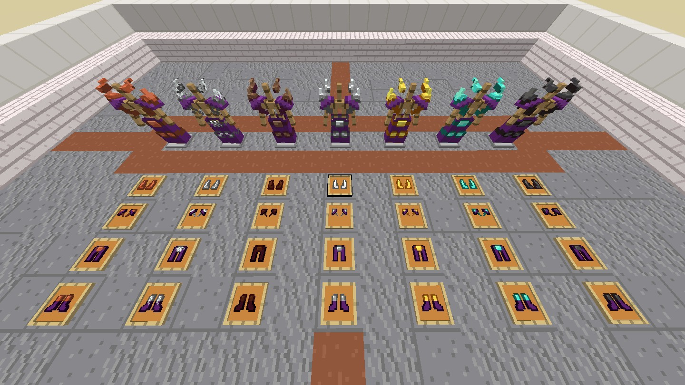

# NefasqueArmor - Textura para Minecraft Bedrock

Este paquete de recursos personaliza las texturas de las armaduras en Minecraft Bedrock Edition. Al instalarlo, verás nuevos diseños visuales para todas las armaduras del juego, dándoles un aspecto único y renovado.



## Instalación

1. Descarga y coloca la carpeta `NefasqueArmor` en la ruta:
   ```
   games/com.mojang/development_resource_packs/
   ```
2. Activa el paquete desde la configuración de recursos en Minecraft Bedrock.

## Características

- Cambia la apariencia de todas las armaduras estándar.
- Compatible con la mayoría de versiones recientes de Minecraft Bedrock.

> **Nota:**  
> Este paquete **no es compatible** con las plantillas de herrería (Smithing Templates). Si usas plantillas de herrería para personalizar armaduras, los cambios visuales de este paquete podrían no aplicarse correctamente o causar conflictos gráficos.